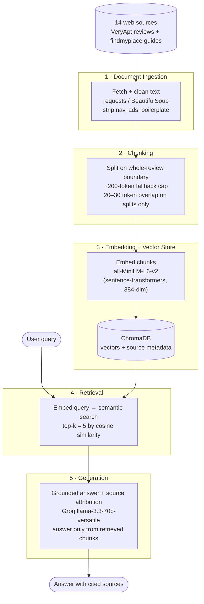

# Project 1 Planning: The Unofficial Guide

> Write this document before you write any pipeline code.
> Your spec and architecture diagram are what you'll use to direct AI tools (Claude, Copilot, etc.) to generate your implementation — the more specific they are, the more useful the generated code will be.
> Update the Retrieval Approach and Chunking Strategy sections if you change your approach during implementation.
> Update this file before starting any stretch features.

---

## Domain

<!-- What domain did you choose? Why is this knowledge valuable and hard to find through official channels? -->
I decided to choose the domain of off-campus housing for my college, UCSD, as it can be hard to navigate through as a sophomore transitioning into their 3rd year, or for a transfer student just arriving to the school, or for anybody who has to find housing off-campus. Current knowledge is outdated. It's harder to navigate through random online sources that may or may not be valid, finding on-campus resources, and getting word-of-mouth; therefore, an unofficial guide would fill this knowledge gap and make it easier for any student to obtain that information ungatekept.

---

## Documents

<!-- List your specific sources: URLs, subreddit names, forum threads, or file descriptions.
     Aim for at least 10 sources that together cover different subtopics or perspectives within your domain. -->

All URLs verified to resolve (HTTP 200) on 2026-06-09. Reddit (r/UCSD), Yelp, ApartmentRatings, and Niche were dropped because they hard-block automated fetching — the two sources below (VeryApt resident reviews + findmyplace student-housing guides) extract cleanly and together span 6 complexes, 4 neighborhoods, and cost/commute/roommate topics.

| # | Source | Description | URL or location |
|---|--------|-------------|-----------------|
| 1 | VeryApt — Costa Verde Village reviews | Resident reviews of the UTC complex: roaches, thin walls/noise, parking shortage and car vandalism, near the UTC trolley (13 reviews, 5.3/10) | https://www.veryapt.com/ApartmentReview-a25717-costa-verde-village-san-diego |
| 2 | VeryApt — Nobel Court reviews | Renter experiences on Nobel Dr / UTC: management, amenities, walkability to Trader Joe's/Ralph's and shuttle stops | https://www.veryapt.com/ApartmentReview-a5512-nobel-court-san-diego |
| 3 | VeryApt — Regents La Jolla reviews | Student reviews: ~10-min bike to UCSD, gated security, rising rents, crowding (4–8 people per unit) | https://www.veryapt.com/ApartmentReview-a5544-regents-la-jolla-san-diego |
| 4 | VeryApt — La Regencia reviews | One of the cheapest La Jolla student complexes: good value/maintenance vs. nightmare parking, night noise, older interiors, safety concerns | https://www.veryapt.com/ApartmentReview-a5483-la-regencia-san-diego |
| 5 | VeryApt — La Jolla del Sol reviews | Budget UCSD-adjacent complex: well-kept pools/tennis/gym, quiet, but annual rent hikes and management communication issues | https://www.veryapt.com/ApartmentReview-a24827-la-jolla-del-sol-san-diego |
| 6 | VeryApt — Solazzo / Villa La Jolla reviews | Lower-rent older Villa La Jolla Dr complex within walking distance of campus | https://www.veryapt.com/ApartmentReview-a5573-solazzo-apartments-homes-san-diego |
| 7 | VeryApt — La Jolla apartments index (19 complexes) | Aggregated ratings/review links for 19 La Jolla/UCSD-area complexes — supports "which complex" comparison questions | https://www.veryapt.com/Apartments-L5628-san-diego-la-jolla |
| 8 | VeryApt — La Jolla neighborhood guide | Living-in-La-Jolla overview: median rent, transit, walkability to UCSD, resident satisfaction scores | https://www.veryapt.com/guides/neighborhood/465-san-diego-la-jolla/ |
| 9 | VeryApt — University City neighborhood guide | Prime student neighborhood next to campus: rent (studio $1,900 / 1BR $2,100 / 2BR $2,500), transit/shuttle access, 7.4/10 | https://www.veryapt.com/guides/neighborhood/507-san-diego-university-city/ |
| 10 | VeryApt — Mira Mesa neighborhood guide | Lower-cost suburban area along I-5: rent (studio $1,400 / 1BR $1,800 / 2BR $2,000), value/amenity ratings | https://www.veryapt.com/guides/neighborhood/464-san-diego-mira-mesa/ |
| 11 | VeryApt — Clairemont Mesa neighborhood guide | More affordable, car-dependent alternative under University City, <3 miles from campus | https://www.veryapt.com/guides/neighborhood/509-san-diego-clairemont-mesa/ |
| 12 | findmyplace — Best Neighborhoods for UCSD Off-Campus Housing | Where UCSD students actually live and why — La Jolla/UTC vs. Clairemont vs. Mira Mesa, with commute tradeoffs | https://findmyplace.co/blog/best-neighborhoods-near-ucsd-for-students/ |
| 13 | findmyplace — San Diego Student Housing Costs (2026) | Cost breakdown: $800–$1,600/mo per person, shared vs. private room pricing, +$150–$300 utilities/parking, $2,000–$4,000 move-in | https://findmyplace.co/blog/san-diego-student-housing-costs-2026/ |
| 14 | findmyplace — UCSD Off-Campus Housing Timeline | Month-by-month search timeline, roommate planning, and advice on checking sublease/lease-transfer policies before signing | https://findmyplace.co/blog/ucsd-off-campus-housing-timeline/ |

---

## Chunking Strategy

<!-- How will you split documents into chunks?
     State your chunk size (in tokens or characters), overlap size, and explain why those
     numbers fit the structure of your documents.
     A review-heavy corpus warrants different chunking than a long FAQ. -->

**Chunk size:**
The main method for how the document will be split into chunks will be one complete review of a unit with a fall back cap of roughly 200 tokens.

**Overlap:**
The overlap is small with roughly 20-30 tokens, but only when the fallback splits since whole reviews don't need an overapp as they're self-contained.

**Reasoning:**
Since most of my documents are short reviews, the important info is usually packed into a few sentences, so splitting on a full review keeps each opinion together with the complex it's about instead of getting cut off mid-thought. I went with tokens for the fallback cap because the embedding model (all-MiniLM-L6-v2) maxes out at 256 tokens and just truncates anything past that, so ~200 leaves room and only kicks in on the longer findmyplace guides. I kept the overlap small and only on those fallback splits because whole reviews already stand on their own, so overlapping them would just repeat content and make retrieval less sharp.

**Update (Milestone 3):** building it, I added one tweak — the findmyplace blogs are long-form prose, so splitting them by paragraph left tiny fragment chunks like "TL;DR" or the author byline. For the blog docs only I now greedily pack paragraphs up to the 200-token cap so headings bind to their text; reviews and guides still stay one-unit-per-chunk. Final corpus: **117 chunks** across the 14 docs (avg ~102 tokens, max 200, none empty).

---

## Retrieval Approach

<!-- Which embedding model are you using (e.g., all-MiniLM-L6-v2 via sentence-transformers)?
     How many chunks will you retrieve per query (top-k)?
     If you were deploying this for real users and cost wasn't a constraint, what tradeoffs
     would you weigh in choosing a different embedding model — context length, multilingual
     support, accuracy on domain-specific text, latency? -->

**Embedding model:**
The embedding model is all-MiniLM-L6-v2 via sentence-transformers.

**Top-k:**
Top-k of k = 5.

**Production tradeoff reflection:**
I picked all-MiniLM-L6-v2 because it runs locally with no API key, it's fast, and it's plenty for short English housing reviews. If cost and real users weren't a constraint, the main reason I'd swap it out is domain accuracy — housing reviews are full of slang and synonyms (packed/crowded, loud/thin walls, roaches/bugs), and a stronger model like bge-large-en-v1.5 or OpenAI's text-embedding-3-large would match those paraphrases more reliably so a query like "pest problems" still pulls the right reviews. Multilingual support would only matter if I added non-English sources later (e.g. international-student posts), and context length barely matters here since my chunks are short reviews well under MiniLM's 256-token limit. The tradeoff for any of those upgrades is latency — the bigger local models or an API round-trip are slower than MiniLM — but since I'm only retrieving k=5 over a small corpus, that speed hit wouldn't really be noticeable.

---

## Evaluation Plan

<!-- List your 5 test questions with their expected correct answers.
     Questions should be specific enough that you can judge whether the system's response
     is right or wrong. "What are good dining halls?" is too vague.
     "What do students say about wait times at [dining hall name] during lunch?" is testable. -->

| # | Question | Expected answer |
|---|----------|-----------------|
| 1 | What do residents complain about most at Costa Verde Village? | Recurring roaches/pests, thin walls and noise, a parking shortage, and reports of car break-ins/vandalism — overall a low ~5/10 rating despite the convenient UTC location. |
| 2 | How does median 1-bedroom rent in University City compare to Mira Mesa? | University City is more expensive (~$2,100/mo for a 1BR) than Mira Mesa (~$1,800/mo); Mira Mesa is the budget tradeoff but is more car-dependent and farther from campus. |
| 3 | How crowded do students say Regents La Jolla units get? | Students report units packed with 4–8 people, alongside rising rents — though it's gated and only about a 10-minute bike to campus. |
| 4 | According to the guides, which neighborhood is the budget option for UCSD students, and what commute tradeoff do they cite? | Mira Mesa (and Clairemont) — lower rent than La Jolla/UTC, but it's more car-dependent and a longer commute to campus. |
| 5 | What downsides do reviewers report about La Regencia despite its low rent? | Nightmare parking, nighttime noise, older interiors, and safety concerns. |

---

## Anticipated Challenges

<!-- What could go wrong? Name at least two specific risks with reasoning.
     Consider: noisy or inconsistent documents, missing source attribution, off-topic
     retrieval, chunks that split key information across boundaries. -->

1. **Source concentration → thin coverage on some subtopics.** Because Reddit, Yelp, ApartmentRatings, and Niche all block automated fetching, the corpus draws from only two sites (VeryApt + findmyplace). Specific complex reviews, the four main neighborhoods, and cost are well covered, but Pacific Beach / North Park and authentic Reddit-style student discussion are thin. A query like "What do students say about living in Pacific Beach?" may retrieve loosely-related La Jolla content and produce a weakly-grounded or hallucinated answer — a strong candidate for the required evaluation failure case.

2. **Conflicting / outdated facts across documents.** Rent figures and resident opinions disagree between sources and over time (e.g., a guide's "median 1BR" vs. an individual review's quoted rent; a 2026 cost article vs. older review text). Retrieval may surface two chunks that contradict each other, so the generation step must attribute each claim to its source rather than averaging them into one confident-but-wrong number.

3. **Reviews split key info across chunk boundaries.** Individual reviews bundle several distinct points (parking, noise, management, safety) into one short blurb. If chunking is too aggressive it can separate a complaint from the complex name it refers to, breaking attribution; if too coarse it dilutes the relevant sentence within unrelated text — informing the chunking decisions in Milestone 2.

---

## Architecture

<!-- Draw a diagram of your pipeline showing the five stages:
     Document Ingestion → Chunking → Embedding + Vector Store → Retrieval → Generation
     Label each stage with the tool or library you're using.
     You can use ASCII art, a Mermaid diagram, or embed a sketch as an image.
     You'll use this diagram as context when prompting AI tools to implement each stage. -->

---

## AI Tool Plan

<!-- For each part of the pipeline below, describe:
     - Which AI tool you plan to use (Claude, Copilot, ChatGPT, etc.)
     - What you'll give it as input (which sections of this planning.md, which requirements)
     - What you expect it to produce
     - How you'll verify the output matches your spec

     "I'll use AI to help me code" is not a plan.
     "I'll give Claude my Chunking Strategy section and ask it to implement chunk_text()
     with my specified chunk size and overlap" is a plan. -->

**Milestone 3 — Ingestion and chunking:**

- *AI tool:* Claude (Claude Code).
- *Input I'll give it:* my Documents table (the 14 source URLs) plus my Chunking Strategy section, and tell it the pages are HTML from VeryApt and findmyplace (not PDFs).
- *What I expect it to produce:* an ingestion script that fetches each URL, strips the nav/ads/boilerplate down to clean review/guide text, and a `chunk_text()` that splits on whole-review boundaries with my ~200-token fallback cap and 20–30 token overlap only on the fallback splits.
- *How I'll verify it:* spot-check a few saved text files to confirm the junk is gone, and print a handful of chunks to make sure whole reviews stay intact and nothing got cut mid-thought or blew past the token cap.

**Milestone 4 — Embedding and retrieval:**

- *AI tool:* Claude (Claude Code).
- *Input I'll give it:* my Retrieval Approach section — embedding model `all-MiniLM-L6-v2` via sentence-transformers, ChromaDB as the store, top-k = 5 — and tell it to keep each chunk's source (URL/complex name) as metadata for attribution.
- *What I expect it to produce:* code that embeds every chunk, stores vectors + source metadata in ChromaDB, and a `search(query)` that embeds the query and returns the top-5 chunks by cosine similarity with their sources.
- *How I'll verify it:* run my 5 eval questions and eyeball whether the retrieved chunks are actually about the right complex/neighborhood before I add any generation, since most RAG failures are retrieval failures.

**Milestone 5 — Generation and interface:**

- *AI tool:* Claude (Claude Code).
- *Input I'll give it:* the Grounded Response requirement (answer only from retrieved chunks + cite sources) and tell it to use Groq `llama-3.3-70b-versatile` with the top-5 chunks from Milestone 4 as context.
- *What I expect it to produce:* a prompt that forces the model to answer only from the retrieved chunks and say when it doesn't know, the answer with its cited sources, and a simple CLI/notebook interface to type a query and see the result.
- *How I'll verify it:* run my 5 eval questions, check each answer is grounded in the cited chunks (no made-up facts), and deliberately ask the thin Pacific Beach question to confirm it refuses instead of hallucinating.
